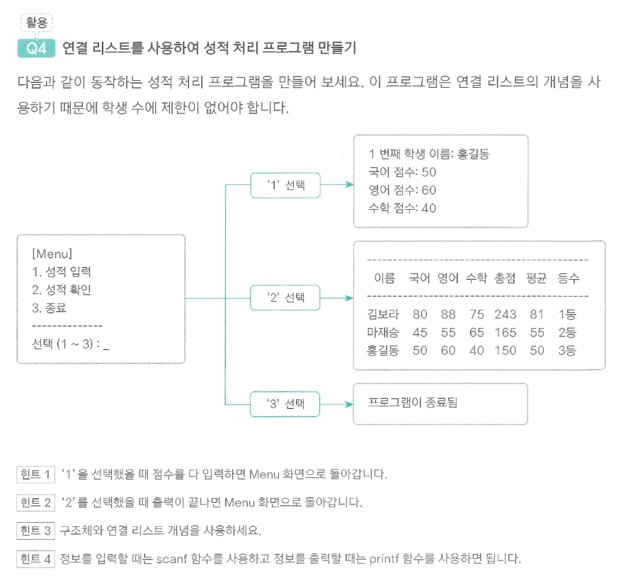
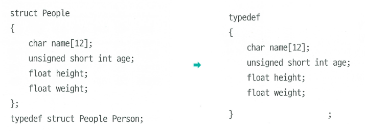

[](https://classroom.github.com/a/JWHOiOfS)
# 15-c-final-test

이미지 따라하고 C 프로그램을 작성하세요.



다음 이미지는 struct 예시입니다. 비슷한 Student `struct` 만들어주세요.



변경 내용:

[프로젝트 또는 시험 지침]
- 아래의 요구 사항을 충족하는 C 프로그램을 작성하세요
- 학생 정보를 저장하기 위해 Student 구조체를 정의하세요.
   - 구조체는 이름, 국어 점수, 영어 점수, 수학 점수를 포함해야 합니다.
- 프로그램은 아래 메뉴를 출력해야 합니다:
```
[Menu]
1. .dat 파일에서 데이터 읽기
2. 추가 학생 정보 입력
3. .dat 파일 저장
4. 성적 확인 (평균 계산 등)
5. 종료
-------------------
선택(1~5):
```

- 메뉴에 따라 다음을 구현하세요:
    1. 이진 파일(.dat)에서 학생 데이터를 읽습니다.
    2. 사용자로부터 추가 학생 정보를 입력받아 배열에 저장합니다.
    3. 현재 데이터를 이진 파일(.dat)에 저장합니다.
    4. 입력된 성적과 총점, 평균, 등수를 출력합니다.
    5. 프로그램을 종료합니다.

[제출물]

1. 완성된 C 코드
2. 프로그램 실행 결과 스크린샷
